要求三：

1. 

INSERT INTO member (name, username, password)
VALUES ('test', 'test', 'test'),
       ('1', '1', '1'),
       ('2', '2', '2'),
       ('3', '3', '3'),
       ('4', '4', '4');

 
2. 

SELECT * FROM member;
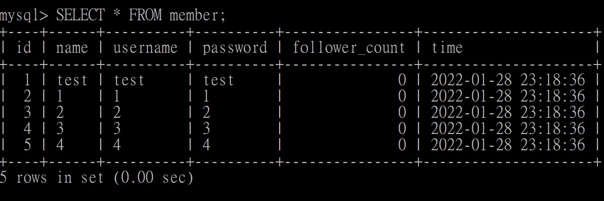
 
3. 

SELECT * FROM member
ORDER BY time DESC;
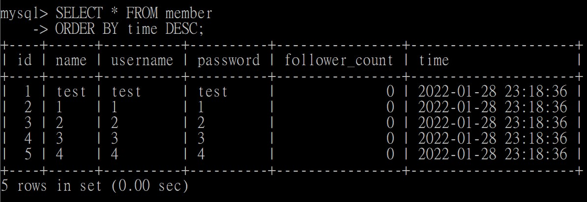
 
4.

SELECT * FROM member
ORDER BY time DESC
LIMIT 3 OFFSET 1;
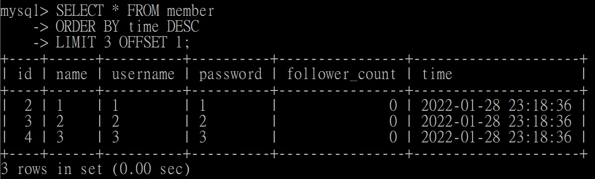
 
5.

SELECT * FROM member 
WHERE username = 'test';
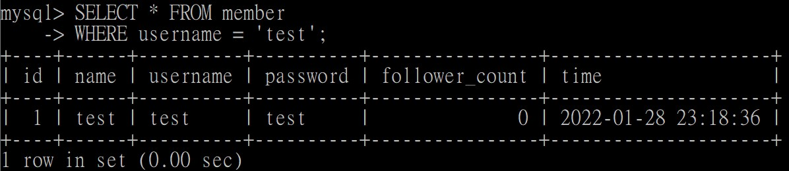
 
6.

SELECT * FROM member
WHERE username = 'test' 
AND password = 'test';
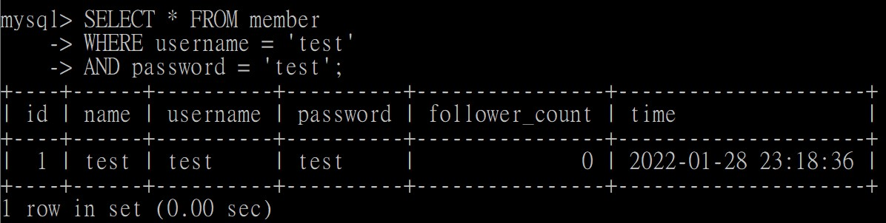
 
7. 
UPDATE member
SET name = 'test2'
WHERE name = 'test';
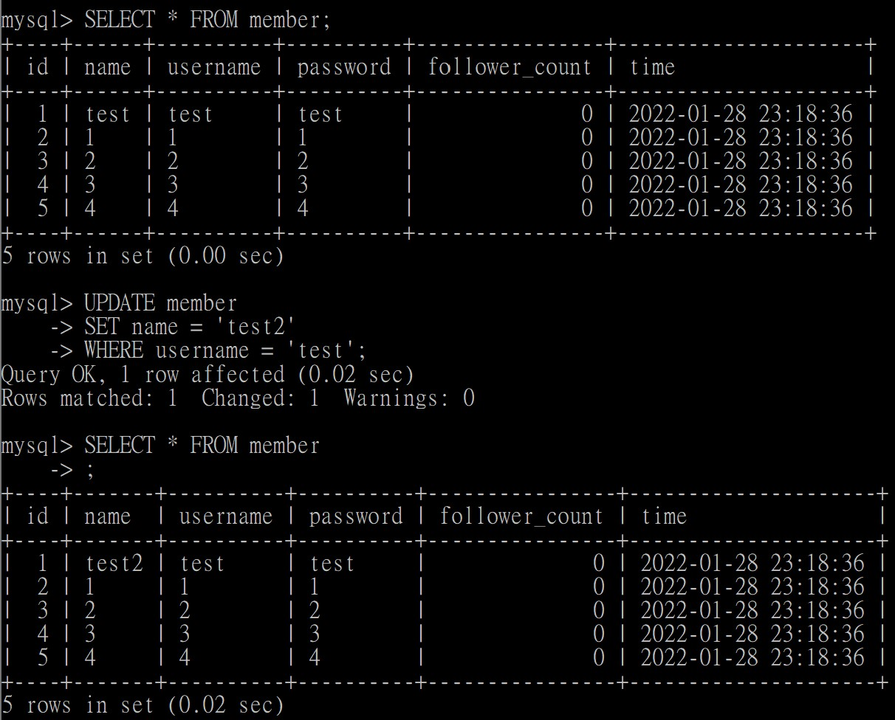
 
要求四：

1. 

SELECT COUNT(*) FROM member;
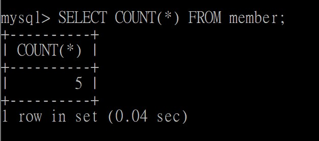
 
2. 

SELECT SUM(follower_count) FROM member;
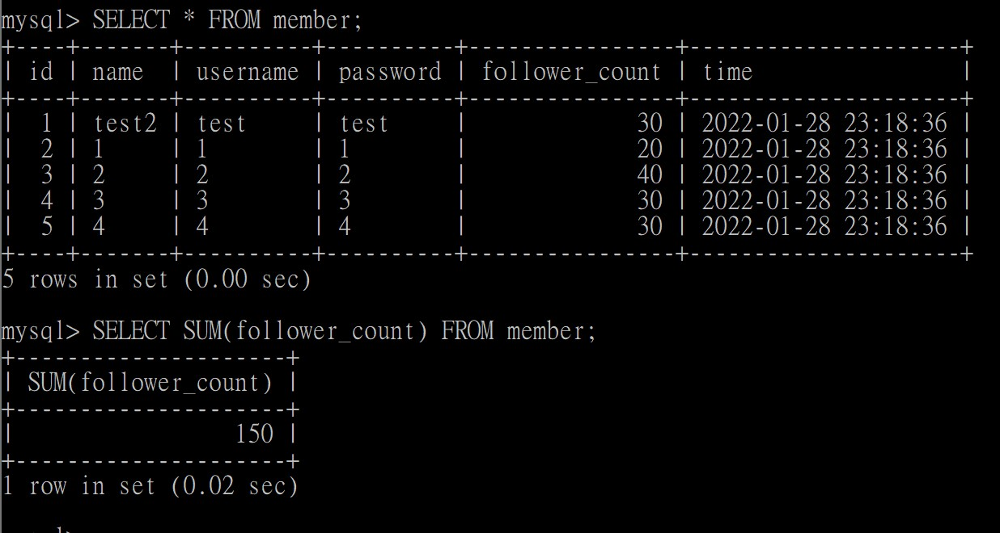
 
3. 

SELECT AVG(follower_count) FROM member;
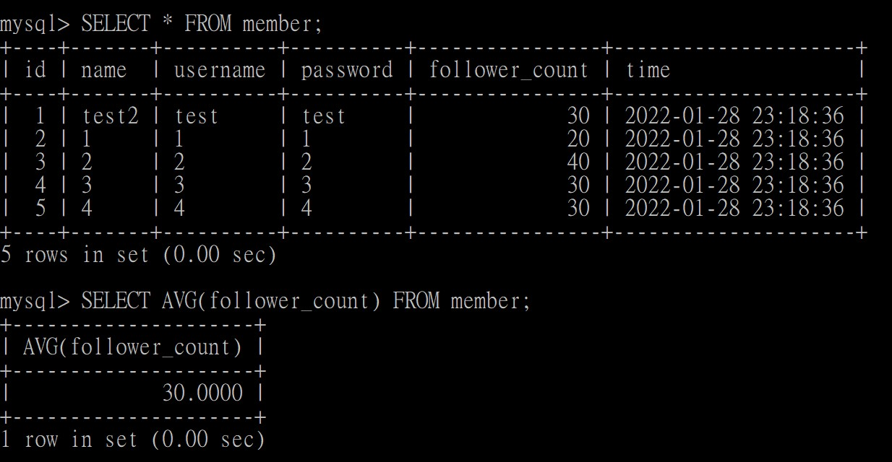
 
要求五：

1. 

SELECT message.content, member.name
FROM message
RIGHT JOIN member ON message.member_id = member.id;
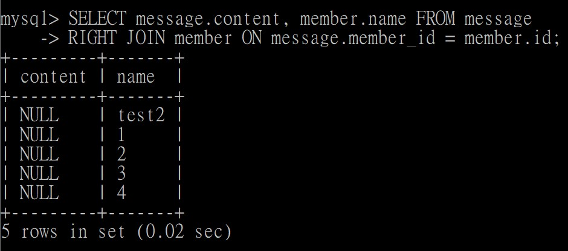
 
2. 

SELECT message.content, member.name 
FROM message
RIGHT JOIN member ON message.member_id = member.id
WHERE username = 'test';
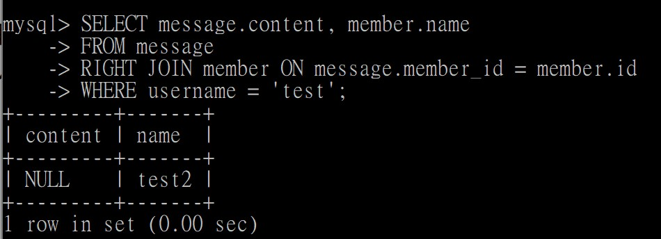
 
